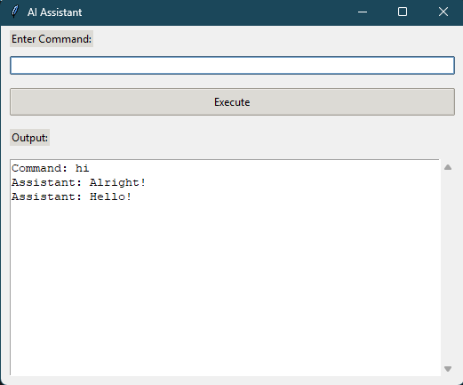

# Voice/Command Controlled AI Assistant

## Overview

This is a personal AI assistant that allows users to control their computer and perform various tasks using natural language commands. It leverages the power of Groq AI to dynamically translate user commands into executable Python code, which is then run on the local system. This enables a hands-free or command-driven approach to interacting with your computer.

## Features

* **Natural Language Command Processing:** Accepts user commands in plain English.
* **Dynamic Python Code Generation:** Utilizes Groq AI to convert commands into Python code snippets.
* **Real-time Task Execution:** Executes the generated Python code to perform the requested actions.
* **Desktop Integration:** Designed to run locally on your personal computer.
* **Example Tasks:** (Note: The actual capabilities depend on the Groq AI's interpretation and the implemented code in `cmd_to_py.py`)
    * Opening websites in a web browser.
    * Controlling applications (e.g., closing specific programs, opening system utilities).
    * Potentially interacting with the operating system (depending on the generated code).
* **User Interface (GUI):** Provides a simple graphical interface built with Tkinter for easy command input and output viewing.
* **Global Hotkey Activation:** Can be activated using a global hotkey (`Win + Space` by default) for quick access without needing to switch focus to a terminal.
* **Speech Output:** Provides auditory feedback using the `pyttsx3` library.

## Setup and Installation

1.  **Prerequisites:**
    * **Python 3.x:** Ensure you have Python 3 installed on your system.
    * **pip:** Python package installer (usually comes with Python).
    * **Groq API Key:** You will need an active API key from Groq to utilize their language models.

2.  **Installation Steps:**
    * **Clone the repository (if applicable):** If you have your code in a repository (e.g., on GitHub), clone it to your local machine.
    * **Install required Python libraries:** Open your terminal or command prompt, navigate to the project directory, and run:
        ```bash
        pip install groq keyboard pyttsx3 sounddevice numpy whisper
        ```
    * **Set up Groq API Key:**
        * Locate the `store.py` file in your project.
        * Replace the placeholder in the `API_KEY()` function with your actual Groq API key. **Keep this key secure and do not share it publicly.**
    * **(Optional) Hotkey Registration:** To enable the global hotkey (`Win + Space`), run the `register_hotkey.py` script once. This will set up a background process to listen for the hotkey.

## Usage

1.  **Running the Assistant:**
    * **With GUI:** Run the `assistant_gui.py` script:
        ```bash
        python assistant_gui.py
        ```
        This will open the graphical user interface. Enter your command in the text field and click "Execute" or press Enter. The output (generated code and execution results) will be displayed in the output area.
    * **With Global Hotkey:** If you have run `register_hotkey.py`, you can press `Win + Space` at any time to bring up the AI Assistant GUI.
    * **(Without GUI - for direct command line input):** You can also interact with the core functionality directly by running the main script (the one with the `if __name__ == "__main__":` block that takes `input("Enter command: ")`).

2.  **Giving Commands:**
    * Use natural language to tell the assistant what you want it to do. Be as clear and specific as possible.
    * Examples:
        * "Open Google Chrome and go to youtube.com"
        * "Close Visual Studio Code"
        * "Open the Windows Task Manager"
        * "What is the current time?" (The effectiveness of this depends on how Groq AI translates it)

## Code Structure

* `assistant_gui.py`: Contains the Tkinter code for the graphical user interface.
* `cmd_to_py.py`: Contains the logic for communicating with the Groq AI to generate Python code from user commands and the function to execute the generated code.
* `hotword2.py`: (Potentially) Contains functions for hotword detection and speech synthesis (`speak` function).
* `store.py`: Stores sensitive information like your Groq API key (should be handled securely).
* `register_hotkey.py`: (Optional) Script to register the global `Win + Space` hotkey to open the GUI.
* `whisper_related_files.py` (or similar): Contains code related to speech-to-text using the Whisper model (if implemented).

## Important Notes and Limitations

* **Groq AI Dependence:** The assistant's ability to understand and execute commands is heavily reliant on the capabilities of the Groq AI model you are using.
* **Code Execution Risks:** Executing dynamically generated code can pose security risks if not handled carefully. This assistant currently executes code locally with the user's privileges. Be cautious with the commands you give.
* **Error Handling:** While some basic error handling is included, the system might not gracefully handle all possible errors during code generation or execution.
* **Operating System Specifics:** Some commands (especially those related to application control) might be specific to the operating system you are using.
* **API Usage Costs:** Using the Groq API may incur costs depending on your usage. Be aware of your API usage limits and pricing.
* **Whisper Model (if used):** The accuracy of voice commands depends on the Whisper model and the quality of the audio input.

## Future Enhancements (Optional)

* More robust error handling and user feedback.
* Improved natural language understanding and more complex task execution.
* User configuration for hotkeys and other settings.
* More sophisticated UI with additional features.
* Sandboxing or safer execution of generated code.
* Integration with other AI models or services.

## Contributing

(Optional) If you plan to share your project, you can add a section on how others can contribute.

## License

(Optional) Specify the license under which your project is distributed.

---

Feel free to adapt this README to the specific details and features of your AI assistant. Good luck with your project!